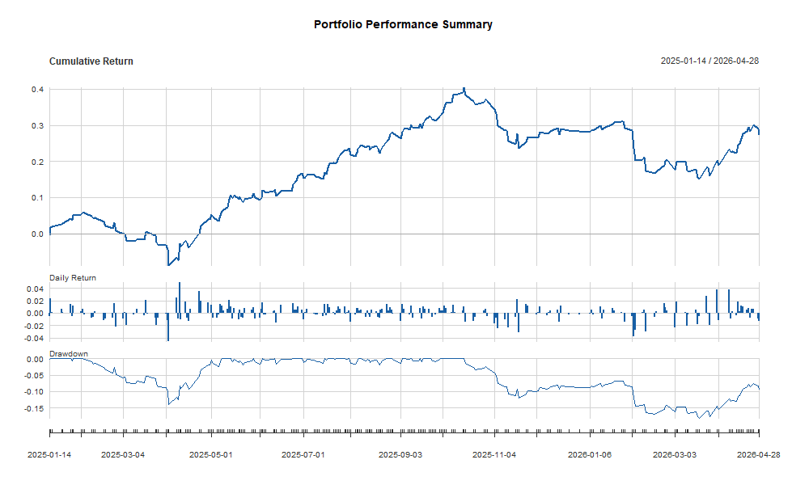
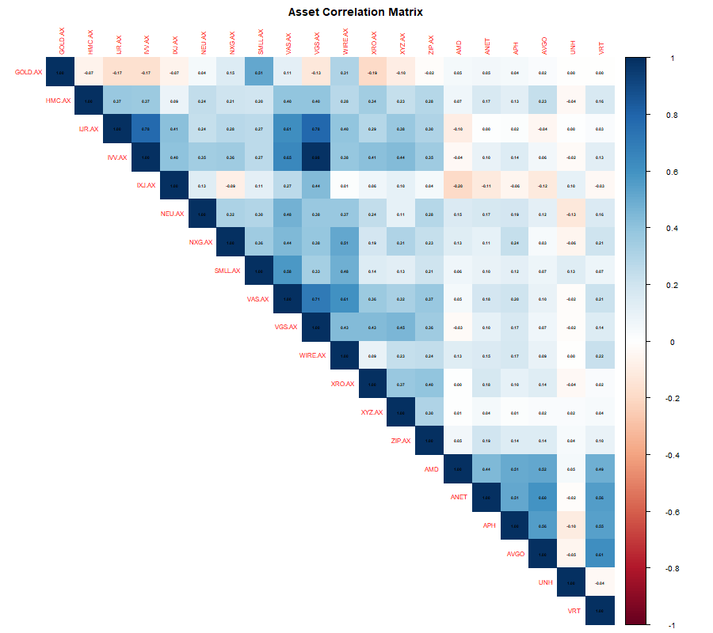
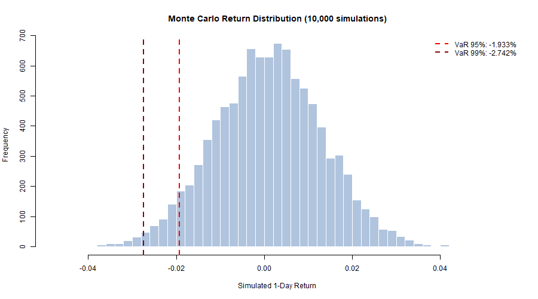
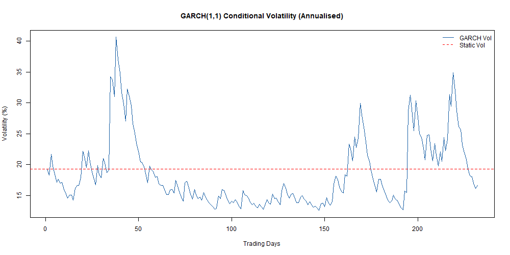
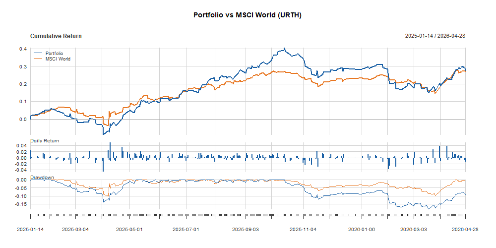

# Portfolio Risk Engine (R)

A quantitative risk analytics engine built in R, applied to a real 20-asset 
global equity portfolio spanning ASX and US equities worth AUD $77,544.

Implements the core risk measurement framework used by institutional risk 
teams and financial regulators — from basic return metrics through to GARCH 
volatility modelling and regulatory VaR backtesting.

---

## Results

| Metric | Value |
| Annual Return | 29.89% |
| Annual Volatility | 19.28% |
| Sharpe Ratio | 1.23 |
| Sortino Ratio | 1.79 |
| Max Drawdown | -18.04% |
| Hist VaR 95% (1-day) | -1.91% |
| Hist VaR 99% (1-day) | -3.07% |
| Expected Shortfall (95%) | -2.71% |
| GARCH Persistence (α+β) | 0.93 |
| GARCH Vol Forecast Day 1 | 18.12% |
| Beta vs MSCI World | 0.44 |
| Jensen's Alpha (ann.) | 16.21% |
| Tracking Error | 20.10% |
| Kupiec Test (95%) | PASS (p=0.90) |
| Christoffersen Test | PASS (p=0.64) |

---

## What It Does

### 1. Core Performance Metrics
Annualised return, volatility, Sharpe ratio, Sortino ratio, and maximum 
drawdown using 10 years of daily adjusted close prices from Yahoo Finance.

The Sortino ratio of 1.79 exceeds the Sharpe of 1.23, indicating positive 
skew — upside returns are larger than downside returns.

### 2. Value at Risk and Expected Shortfall
1-day VaR at 95% and 99% confidence using two methods:

- **Historical simulation** — non-parametric, uses the actual empirical 
  return distribution without distributional assumptions
- **Monte Carlo simulation** — parametric, samples 10,000 paths from a 
  fitted normal distribution

Expected Shortfall (CVaR) is reported alongside VaR — the average loss 
conditional on exceeding the VaR threshold. This is the preferred tail 
risk measure under Basel III and IFRS 17.

### 3. GARCH(1,1) Volatility Forecasting
Fits a GARCH(1,1) model with Student-t innovations to the portfolio return 
series using the `rugarch` package.

Financial returns exhibit **volatility clustering** — periods of calm 
followed by turbulence — which a static standard deviation assumption 
misses entirely. GARCH models conditional variance as a function of 
past shocks (α) and past variance (β).

Key results:
- α = 0.1512 (shock impact), β = 0.7822 (persistence)
- Persistence α+β = 0.93 — volatility shocks take ~15 trading days to 
  decay by half
- 21-day forward vol forecast rises from 18.12% to 19.26%, consistent 
  with mean reversion toward the long-run average of 19.28%
- GARCH-implied VaR of -1.72% vs static VaR of -2.00% — current 
  volatility is below its long-run average

### 4. VaR Backtesting — Kupiec and Christoffersen
Validates VaR models against realised returns using the same framework 
regulators apply under Basel III to approve internal risk models.

**Kupiec POF test** — likelihood ratio test on whether the violation rate 
is statistically correct. Too many or too few VaR breaches indicate a 
mis-specified model.

**Christoffersen independence test** — tests whether violations are 
independent over time. Clustered violations (several bad days in a row) 
indicate the model fails to capture volatility clustering.

Results: both Historical VaR and Monte Carlo VaR pass both tests at 
95% confidence. 12 observed violations vs 11.6 expected (Kupiec p=0.90); 
violations are non-clustered (Christoffersen p=0.64).

### 5. Benchmark Comparison vs MSCI World
Computes active return metrics against an iShares MSCI World ETF (URTH):

- **Beta 0.44** — portfolio has low systematic market exposure, driven 
  by concentrated thematic positions rather than broad market beta
- **Jensen's Alpha 16.21%** — annualised excess return above what beta 
  exposure alone would predict
- **Tracking Error 20.10%** — high active risk reflecting thematic 
  concentration in AI infrastructure, uranium and healthcare
- **Information Ratio -0.05** — near-zero, indicating the alpha is not 
  consistently generated per unit of active risk over this window

The portfolio matched MSCI World returns (29.89% vs 29.42%) with higher 
idiosyncratic risk and lower systematic risk — a different risk profile 
rather than a better or worse one.

---

## Charts







---

## Portfolio

20 holdings across ASX and US equities.

| Ticker | Weight | Theme |
|---|---|---|
| IVV.AX | 23.24% | US large cap ETF |
| VAS.AX | 16.82% | Australian broad market ETF |
| NEU.AX | 6.19% | Healthcare / biotech |
| XYZ.AX | 6.17% | Fintech / BNPL |
| NXG.AX | 5.39% | Uranium |
| ZIP.AX | 5.00% | Fintech / BNPL |
| HMC.AX | 4.17% | Alternative asset manager |
| VRT | 3.93% | AI infrastructure |
| AMD | 3.75% | AI semiconductors |
| GOLD.AX | 3.64% | Gold hedge |

---

## Setup

```r
# Install dependencies (run once)
install.packages(c("quantmod", "PerformanceAnalytics", "tidyverse",
                   "lubridate", "corrplot", "scales", "rugarch"))

# Run
source("portfolio_risk_engine.R")
```

No API key required. Data sourced from Yahoo Finance via `quantmod`.

---

## Model Limitations

The Monte Carlo simulation uses a univariate normal distribution which 
underestimates tail risk due to fat tails (excess kurtosis in financial 
returns) and correlation breakdown during market stress. The GARCH model 
partially addresses fat tails via Student-t innovations and captures 
time-varying volatility, but assumes constant correlations across assets.

The backtesting window of 232 trading days is shorter than ideal — Basel 
III recommends a minimum of 250 days. This is a consequence of some ASX 
ETFs having limited history that constrains the joint return matrix.

Realistic extensions would include DCC-GARCH for time-varying correlations, 
filtered historical simulation combining GARCH with empirical scenarios, 
and stressed VaR using 2008 and 2020 market regimes.

---

## Stack

R 4.x · quantmod · PerformanceAnalytics · rugarch · tidyverse · corrplot

---

## Why I Built This

Practical application of quantitative risk techniques relevant to 
actuarial, investments, and risk roles — sourcing real market data, 
implementing industry-standard models from first principles, and 
validating them using the regulatory backtesting framework.
